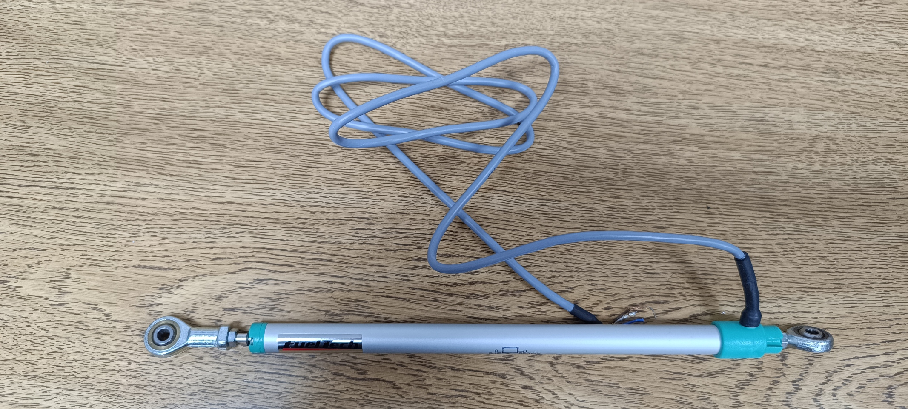
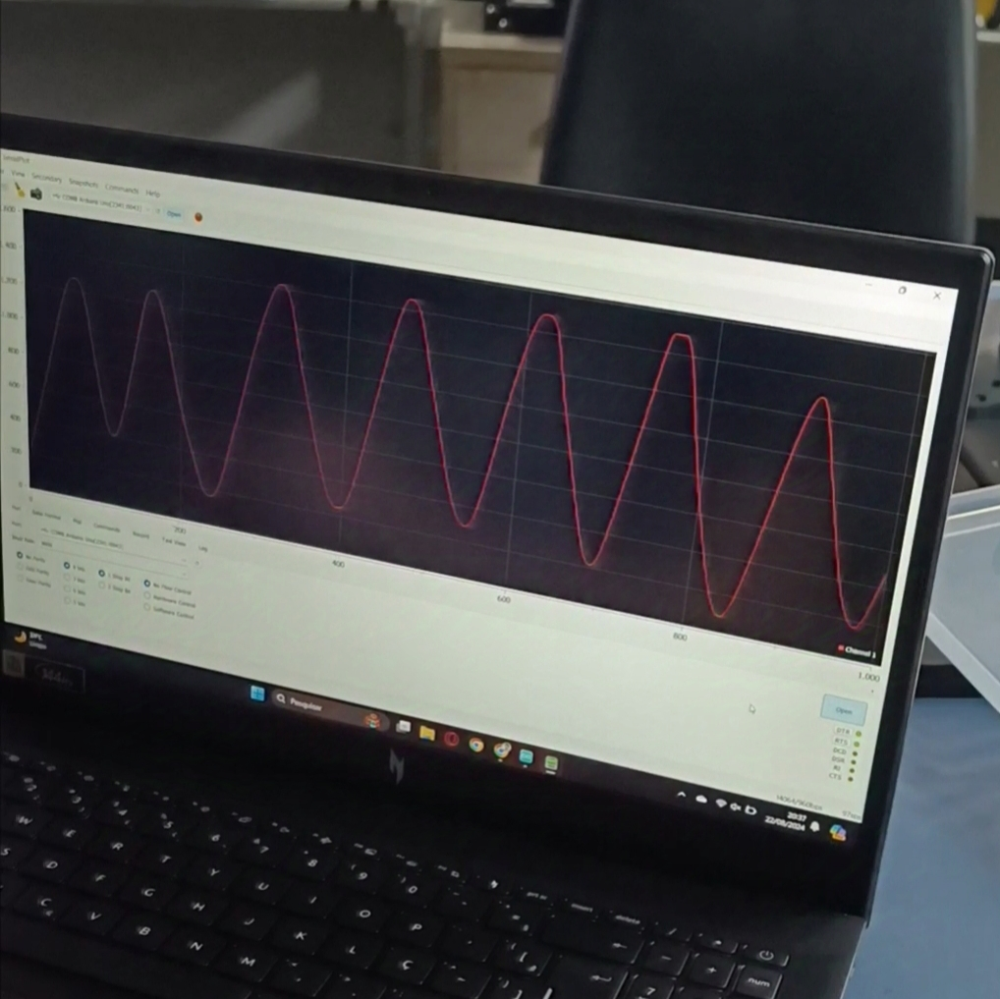

# Suspension Sensor Project

This project consists of code for reading a linear potentiometer sensor installed on a motorcycle's suspension, developed by Lucas Bosso de Mello and Gustavo Garcia on 08/25/2024.

## Project Description

Unlike the fuel sensor, the suspension sensor operates ideally, providing smooth and consistent readings. The graph generated by SerialPlot shows a completely smooth curve, with no need for any additional data processing.

### Perfect Operation

The suspension sensor is highly stable and accurate, and as such, it was not necessary to apply any filters or smoothing methods. The direct reading from the sensor accurately reflects the suspension conditions, ensuring the reliability of the system.

### Project Images

- Suspension sensor photo:

<p align="center">
  
</p>

<br>

- Graph obtained in SerialPlot:

<p align="center">
  
</p>

## [Source Code](potenciometro_linear_suspensao.ino)

```cpp
//------------------------------------------------------------
/* EESC - USP Guepardo / Lucas Bosso de Mello + Gustavo Garcia
   Código para leitura do potenciômetro linear da sensor do tanque de combustível
   25/08/2024
*/ 

# define ADC 0 // porta analógica A0

// ------------------------------------------------------------------------
// Configuração GPIO , periféricos, etc:

void setup ( void ) 
{
  // initialize serial communication at 9600 bits per second:
  Serial.begin ( 9600 );

  // Configuração do ADC:
  analogReference ( DEFAULT ) ; // faixa de tensões elétricas de entrada : 0 V − 5 V
 }

// ------------------------------------------------------------------------

// Loop principal
void loop ( void ) 
{
// ------------------------------------------------------------------------
 
  // Declaração das variáveis
  int leitura = 0; // leitura analógica
  int deformacao = 0; // leitura mapeada
  int valor_tanque = 0; // leitura do tanque de 0 a 100
  int porcentagem_tanque = 0; // porcentagem tanque limitada de 0 a 100


// ------------------------------------------------------------------------

  // Leitura da tensão analógica no pino A0:
  leitura = analogRead (ADC); // analogRead ( pin );
  valor_tanque = map(leitura,783,993,0,100);

  // Limitar a porcentagem para garantir que está entre 0% e 100%
  porcentagem_tanque = constrain(valor_tanque, 0, 100);

  // ------------------------------------------------------------------------
  // Imprimir leitura na porta serial:
  Serial.println(porcentagem_tanque);
  delay(10);
}

